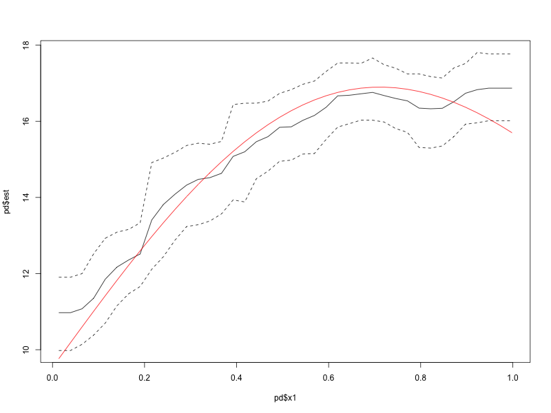

<!-- README.md is generated from README.Rmd. Please edit that file -->

```{r, include = FALSE}
knitr::opts_chunk$set(
  collapse = TRUE,
  comment = "#>",
  fig.path = "man/figures/README-",
  out.width = "100%"
)
```

# pdpd: Partial Dependence for Posterior Distributions

Partial dependence functions ([Friedman 2001](https://doi.org/10.1214/aos/1013203451)) are a popular tool for describing the effect of continuous predictors on a (typically black-box) prediction model for continuous outcomes. Uncertainty intervals for partial dependence functions are typically calculated at each evaluated point using bootstrap sampling. If the predictive model is Bayesian, then pointwise uncertainty estimates can be obtained directly from the posterior distribution. The `pdpd` package allows one to compute point and interval estimates for the partial dependence function when posterior distributions of predictions can be extracted from a model.

## Installation

You can install the development version of `pdpd` from [GitHub](https://github.com/) with:

``` r
# install.packages("devtools")
devtools::install_github("jacobenglert/pdpd")
```

## Example: BART

A popular black-box Bayesian nonparametric model is Bayesian Additive Regression Trees (BART) ([Chipman et al. 2010](https://doi.org/10.1214/09-AOAS285)). BART models can be fit using the [`BART`](https://cran.r-project.org/package=BART) R package, among others.

```{r, echo = FALSE, message = FALSE}
set.seed(2187)
n <- 100
x <- matrix(runif(n*10), nrow = n, ncol = 10) # Matrix of predictors
library(BART)
bartFit <- readRDS('README/bartFit.rds')
```
```{r example, eval = FALSE}
set.seed(2187)
n <- 100 # Number of observations
x <- matrix(runif(n*10), nrow = n, ncol = 10) # Matrix of predictors
colnames(x) <- paste0('x',1:ncol(x))

# True predictive function (Friedman 1991)
f <- function(x) 10*sin(pi*x[,1]*x[,2]) + 20*(x[,3]-.5)^2+10*x[,4]+5*x[,5]

# Simulate outcome
y <- rnorm(n, f(x))

# Fit BART model and request 500 posterior samples
library(BART)
bartFit <- wbart(x, y, nskip = 500, ndpost = 500) 
```

After fitting a model, identify a way to obtain predictions on the training data.

```{r}
dim(predict(bartFit, x))
```

In the `BART` package, rows in the prediction represent posterior samples. Functions in the `pdpd`
package requires the transpose.

```{r, eval = FALSE}
# Create estimated predictive function
f_hat <- function(x) {
  
  # Make predictions (and prevent excessive printing) from the BART package
  capture.output(preds <- t(predict(bartFit, x))) 
  
  return(preds)
}
```

The `bayes_pd()` function is used to compute the partial dependence. It requires the training data and the estimated predictive function (whose columns represent posterior samples).
```{r, eval = FALSE}
library(pdpd)
pd <- bayes_pd(x = x,         # training data
               f_hat = f_hat, # estimated predictive function
               vars = 'x1',   # predictor to examine
               k = 20,        # number of points to evaluate at
               limits = c(0.025, 0.975), # posterior credible interval limits
               f = f) # optionally, true predictive function for comparison
```

The resulting data frame includes point (posterior mean) and pointwise credible interval estimates of the partial dependence function.
```{r, eval = FALSE}
# Plot
plot(pd$est ~ pd$x1, type = 'l', ylim = c(min(pd$lcl), max(pd$ucl)))
lines(pd$lcl ~ pd$x1, type = 'l', lty = 2)
lines(pd$ucl ~ pd$x1, type = 'l', lty = 2)
lines(pd$truth ~ pd$x1, type = 'l', col = 'red')
```
```{r pdx1, fig.align='center', fig.cap='Partial Dependence for x1', out.width='80%', echo = FALSE}

```


## Accumulated Local Effects
In addition to partial dependence functions, this package includes functionality for computing first and second order accumulated local effects (ALE) plots [Apley 2020](https://doi.org/10.1111/rssb.12377). These often run much faster, but the approach to computation is distinct from partial dependence.
